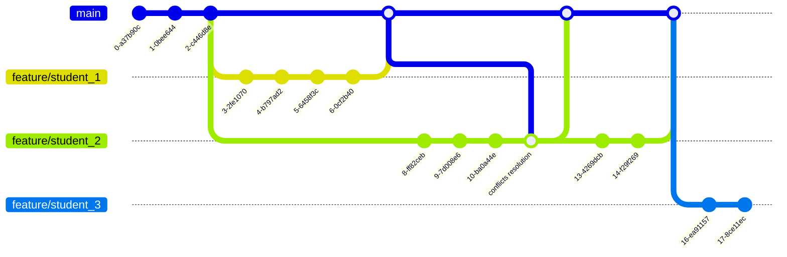

# WiDS2026

## Acerca de la Competencia

Este repositorio contiene el trabajo para la competencia **WiDS (Women in Data Science) Worldwide Global Datathon 2026**. La competencia se enfoca en resolver problemas del mundo real utilizando ciencia de datos, promoviendo la participación de mujeres en el campo de la ciencia de datos.

**Competencia:** [WiDS Worldwide Global Datathon 2026](https://www.kaggle.com/competitions/WiDSWorldWide_GlobalDathon26/overview)

## Descarga de Datos

### Prerrequisitos
- Tener instalado Kaggle CLI: `pip install kaggle`
- Configurar las credenciales de Kaggle (archivo `kaggle.json` en `~/.kaggle/`)

### Procedimiento Estándar

1. **Crear la carpeta de datos:**
   ```bash
   mkdir -p data
   ```

2. **Descargar los datos de la competencia:**
   ```bash
   kaggle competitions download -c WiDSWorldWide_GlobalDathon26 -p data/
   ```

3. **Extraer los archivos (si es necesario):**
   ```bash
   cd data
   unzip "*.zip"
   ```

Los datos se descargarán en la carpeta `/data` del proyecto.

## Estructura del Proyecto

```
WiDS2026/
├── data/                           # Aquí van los datos de la competencia de Kaggle
│   ├── train.csv                   # Conjunto de datos de entrenamiento
│   ├── test.csv                    # Conjunto de datos de prueba
│   ├── sample_submission.csv       # Formato de envío de ejemplo
│   └── metaData.csv                # Metadatos del dataset
├── notebooks/                      # Jupyter notebooks para análisis
├── src/                           # Código fuente del proyecto
│   ├── __init__.py
│   ├── config.py                  # Configuraciones y constantes
│   ├── io.py                      # Carga y manejo de datos
│   ├── targets.py                 # Procesamiento de variables objetivo
│   ├── evaluation.py              # Entrenamiento y evaluación de modelos
│   └── tracking.py                # Tracking con MLflow
├── train.py                       # Script principal de entrenamiento
└── README.md                      # Documentación del proyecto
```

### Descripción de Scripts

- **`train.py`**: Script principal que ejecuta el pipeline completo de entrenamiento y evaluación de modelos
- **`src/config.py`**: Define rutas de datos, columnas, parámetros y configuraciones del proyecto
- **`src/io.py`**: Contiene la clase `Dataset` para cargar y procesar los datos de entrenamiento y prueba
- **`src/targets.py`**: Funciones para crear etiquetas multiclase a partir de datos de supervivencia
- **`src/evaluation.py`**: Clase `ModelEvaluation` para evaluar modelos con métricas y visualizaciones
- **`src/tracking.py`**: Decoradores y funciones para el seguimiento de experimentos con MLflow

# Reglas de uso de Git para el proyecto
Para asegurar un flujo de trabajo organizado y eficiente, todos los estudiantes deben seguir estas reglas de uso de git al contribuir al proyecto.

1. **Ramas (Branching Strategy)**
+ Cada estudiante debe crear una rama personal siguiente la convención de nombres:

    `feature/<apellido>` (en minúsculas, sin acentos).
    Ejemplo: `feature/ramirez`

2. **Commits**
+ Realiza commits de manera regular para llevar un seguimiento del progreso.
+ Evita subir todos tus cambios en un solo commit; divide el trabajo en commits pequeños y significativos.
+ Escribe mensajes de commit claros y descriptivos que expliquen qué se cambió.

3. **Merge con la rama `main`**
+ Antes de enviar un _pull request_, integra la rama `main` más reciente en tu rama.
+ Esto previene conflictos y evita eliminar accidentalmente cambios realizados por otros estudiantes.
+ Resuelve cualquier conflicto de merge de manera local antes de hacer _push_. Por favor no subas conflictos sin resolver.
+ Prueba tu código para asegurarte de que todo funcione correctamente.

4. **Pull requests**
+ Puedes enviar tantos _pull requests_ como sean necesarios.
+ Cada _pull request_ debe estar bien documentado, explicando claramente los cambios realizados y su propósito.
+ Revisa tu código antes de enviar un _pull request_ para asegurarte de que cumple con los estándares del proyecto.

## Ejemplo visual de un flujo de trabajo con git
El siguiente diagrama ilustra el flujo de trabajo de git para diferentes estudiantes.



1. `student_1` (Amarillo) tuvo el escenario más sencillo, ya que fue el primero en hacer merge con la rama `main`.
2. `student_2` (Verde) tuvo que actualizar su rama con los cambios más recientes de `main` y resolver conflictos antes de hacer merge. 
3. `student_2` (Verde) también envió más de un _pull request_, lo cual está permitido. 
4. `student_3` (Azul) comenzó su trabajo más tarde. Esto no representa un problema, pero aún así debe mantener su rama actualizada con `main`. 

Siguiendo estas reglas y aprendiendo del ejemplo anterior, podemos asegurar un proceso de colaboración claro, ordenado y sin conflictos innecesarios.f
